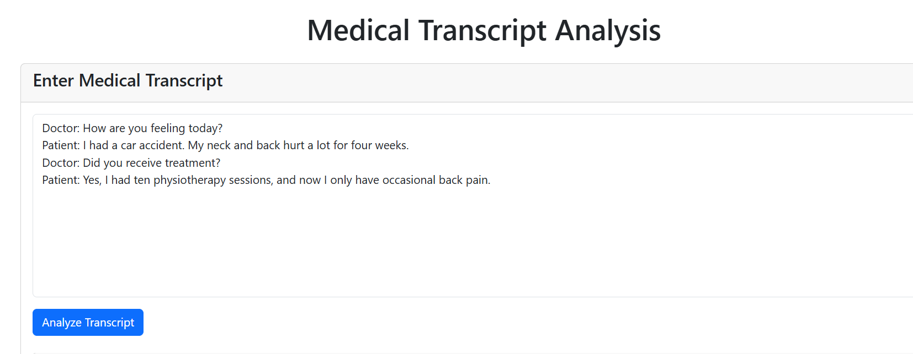
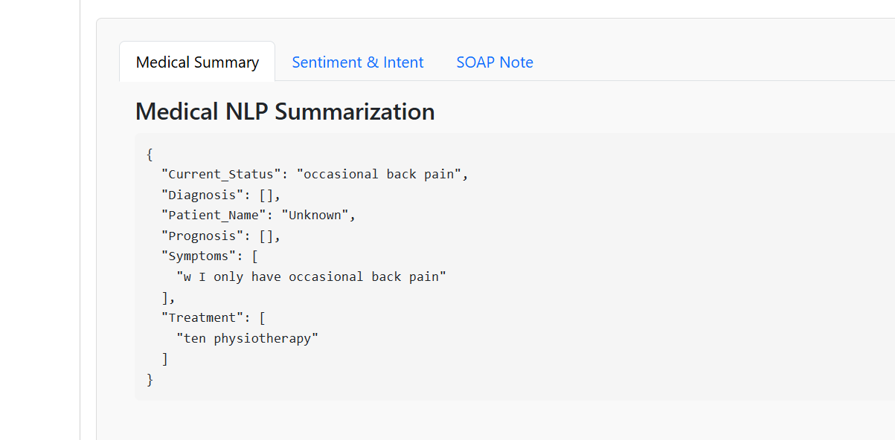
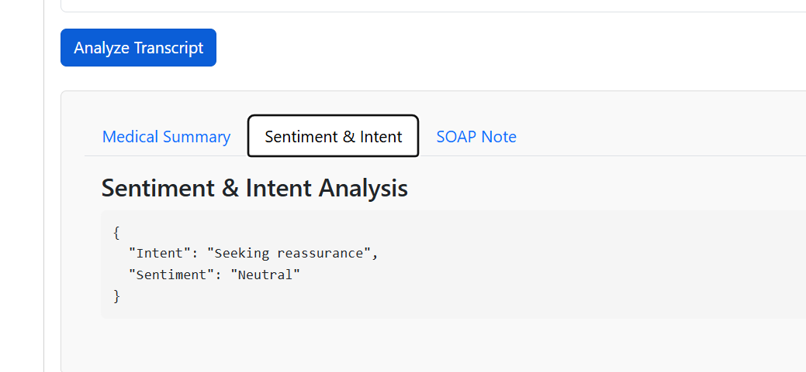
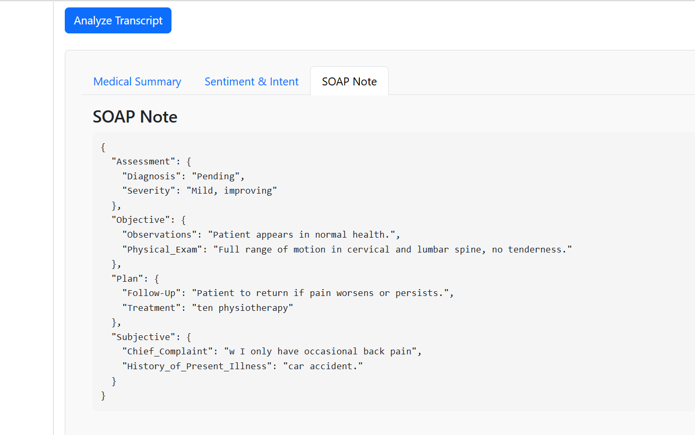

# Medical-Transcript-Analyzer
# Medical NLP System

A lightweight Natural Language Processing system for medical conversation analysis. This system processes doctor-patient conversations to extract medical information, analyze sentiment, and generate structured medical documentation.
## Web App Link

**Click [here](https://medical-transcript-analyzer.onrender.com/) to visit the web app.**

## Webpage snapshots

<div align="center">
    
    
</div>
<div align="center">
    
    
</div>

## Table of Contents
- [Overview](#overview)
- [Installation](#installation)
- [Usage](#usage)
- [Modules](#modules)
  - [1. Medical Details Extraction](#1-medical-details-extraction)
  - [2. Sentiment & Intent Analysis](#2-sentiment--intent-analysis)
  - [3. SOAP Note Generation](#3-soap-note-generation)
- [API Reference](#api-reference)
- [FAQs](#faqs)

## Overview

This application uses lightweight rule-based NLP approaches to analyze medical conversations between physicians and patients. It extracts structured information, analyzes patient sentiment, and generates standardized medical documentation.

Key features:
- Extraction of medical entities (symptoms, treatments, diagnosis, prognosis)
- Patient sentiment and intent analysis
- Automatic SOAP note generation
- RESTful API for easy integration
- Minimal dependencies for improved performance

## Installation

```bash
# Clone the repository
git clone https://github.com/yourusername/medical-nlp-system.git
cd medical-nlp-system

# Install dependencies
pip install -r requirements.txt

# Download NLTK data (only punkt tokenizer is required)
python -c "import nltk; nltk.download('punkt')"
```

## Usage

### Run the Flask application

```bash
python app.py
```

The server will start on http://localhost:5000

### Process a transcript via API

```python
import requests
import json

url = "http://localhost:5000/api/process"
transcript = """
Doctor: How are you feeling today?
Patient: I had a car accident. My neck and back hurt a lot for four weeks.
Doctor: Did you receive treatment?
Patient: Yes, I had ten physiotherapy sessions, and now I only have occasional back pain.
"""

response = requests.post(
    url,
    json={"transcript": transcript}
)

results = response.json()
print(json.dumps(results, indent=2))
```

## Modules

### 1. Medical Details Extraction

The medical details extraction module identifies and structures key medical information from doctor-patient conversations.

#### Features

- **Entity Recognition**: Identifies symptoms, treatments, diagnoses, and prognosis information
- **Patient Information**: Extracts patient names and identifiers
- **Current Status**: Determines the patient's current condition based on context

#### Implementation

The system uses a rule-based approach with regular expressions and keyword matching to extract medical entities. This approach was chosen over heavy ML models to reduce dependencies and improve performance.

```python
# Example usage
from medical_nlp import MedicalNLPPipeline

pipeline = MedicalNLPPipeline()
transcript = "Doctor: How are you feeling today?\nPatient: I had a car accident..."

medical_summary = pipeline.summarize_medical_details(transcript)
print(medical_summary)
```

#### Questions & Answers

**Q: How would you handle ambiguous or missing medical data in the transcript?**

A: The current implementation handles ambiguous or missing data through:
1. **Default values**: When specific information is missing, the system uses "Not specified" or similar placeholders
2. **Context extraction**: The system looks for related context around keywords to extract more complete phrases
3. **Multiple pattern matching**: Several patterns are tried for each entity type to increase chances of finding relevant information
4. **Fallback mechanisms**: When primary patterns fail, the system falls back to simpler pattern matching

**Q: What pre-trained NLP models would you use for medical summarization?**

A: While the current implementation is rule-based for simplicity and performance, ideal pre-trained models would include:
1. **BioBERT**: A biomedical language model pre-trained on PubMed abstracts and PMC full-text articles
2. **ClinicalBERT**: Specifically trained on clinical notes from electronic health records
3. **SciBERT**: Trained on scientific papers, which includes medical research
4. **MedicalNER**: Specialized named entity recognition models for medical terms
5. **Med7**: A clinical NER model designed to extract 7 categories of clinical entities

### 2. Sentiment & Intent Analysis

This module analyzes the emotional state and communicative goals of patients based on their dialogue.

#### Features

- **Sentiment Classification**: Categorizes patient sentiment as Anxious, Neutral, or Reassured
- **Intent Detection**: Identifies why the patient is communicating (seeking reassurance, reporting symptoms, etc.)

#### Implementation

The system uses a rule-based lexicon approach with carefully selected emotional and intentional cues.

```python
# Example usage
from medical_nlp import MedicalNLPPipeline

pipeline = MedicalNLPPipeline()
transcript = "Doctor: How are you feeling today?\nPatient: I'm worried about my back pain..."

sentiment_intent = pipeline.analyze_patient_sentiment_and_intent(transcript)
print(sentiment_intent)
```

#### Questions & Answers

**Q: How would you fine-tune BERT for medical sentiment detection?**

A: To fine-tune BERT for medical sentiment detection:
1. **Dataset preparation**: Collect and annotate doctor-patient conversations with sentiment labels
2. **Model initialization**: Start with BioBERT or ClinicalBERT for better domain adaptation
3. **Train-test split**: Ensure proper data separation to evaluate performance
4. **Hyperparameter tuning**: Optimize learning rate, batch size, and epochs
5. **Cross-validation**: Use k-fold validation to ensure model generalization
6. **Evaluation metrics**: Focus on F1-score given the potential class imbalance in medical sentiment
7. **Threshold adjustment**: Customize decision thresholds based on the specific use case (e.g., prioritize recall for anxious detection)

**Q: What datasets would you use for training a healthcare-specific sentiment model?**

A: Ideal datasets for healthcare-specific sentiment modeling include:
1. **MIMIC-III**: Contains de-identified clinical notes with patient-provider interactions
2. **n2c2 (formerly i2b2) NLP challenges data**: Includes annotated clinical text
3. **PubMed Health Belief Model corpus**: Contains annotated health belief expressions
4. **MedDialog**: A large-scale dataset of doctor-patient conversations
5. **Corona NLP corpus**: COVID-19 specific patient sentiments
6. **Patient Experience Question Bank**: Contains validated measures of patient experience
7. **Custom datasets**: Annotated transcripts from actual clinical encounters (with proper consent)

### 3. SOAP Note Generation

This module automatically generates structured SOAP (Subjective, Objective, Assessment, Plan) notes from medical conversations.

#### Features

- **SOAP Structure**: Organizes conversation content into the standard clinical format
- **Section Mapping**: Intelligently assigns dialogue content to appropriate SOAP sections
- **Concise Formatting**: Presents information in a clinically relevant, scannable format

#### Implementation

The system extracts relevant information for each SOAP section using a combination of medical entity recognition and conversation structure analysis.

```python
# Example usage
from medical_nlp import MedicalNLPPipeline

pipeline = MedicalNLPPipeline()
transcript = "Doctor: How are you feeling today?\nPatient: I had a car accident..."

soap_note = pipeline.generate_soap_note(transcript)
print(soap_note)
```

#### Questions & Answers

**Q: How would you train an NLP model to map medical transcripts into SOAP format?**

A: Training an NLP model to map transcripts to SOAP format would involve:
1. **Data collection**: Gather paired examples of conversations and corresponding SOAP notes
2. **Data annotation**: Label sections of conversations that correspond to S, O, A, and P components
3. **Sequence labeling**: Train a model (BiLSTM-CRF or Transformer-based) to tag conversation parts
4. **Section classification**: Use a classifier to determine which SOAP section each sentence belongs to
5. **Template filling**: Extract key information to populate standardized SOAP templates
6. **Summarization models**: Fine-tune models like T5 or BART to summarize longer sections
7. **Hierarchical approach**: First classify dialogue by speaker (doctor/patient), then by SOAP section
8. **Domain adaptation**: Start with medical language models and adapt to the SOAP format task

**Q: What rule-based or deep-learning techniques would improve the accuracy of SOAP note generation?**

A: To improve SOAP note generation accuracy:

**Rule-based improvements:**
1. **Medical ontology integration**: Map terms to standardized medical ontologies like SNOMED CT
2. **Dialogue act classification**: Identify question-answer pairs and their clinical relevance
3. **Temporal reasoning**: Extract and order events chronologically using temporal expressions
4. **Negation detection**: Identify denied symptoms or conditions
5. **Certainty classification**: Determine confidence levels in reported information

**Deep learning improvements:**
1. **Hierarchical attention networks**: Focus on important parts of the conversation
2. **Multi-task learning**: Train for entity extraction and section classification simultaneously
3. **Few-shot learning**: Adapt to new medical specialties with minimal examples
4. **Knowledge graph integration**: Incorporate medical knowledge for improved reasoning
5. **Reinforcement learning**: Optimize for clinical utility rather than just text similarity

## API Reference

### `/api/process`

**Method**: POST

**Request Body**:
```json
{
  "transcript": "Doctor: How are you feeling today?\nPatient: I had a car accident..."
}
```

**Response**:
```json
{
  "medical_summary": {
    "Patient_Name": "Unknown",
    "Symptoms": ["Neck pain", "Back pain"],
    "Diagnosis": ["Whiplash injury"],
    "Treatment": ["10 physiotherapy sessions"],
    "Current_Status": "Occasional back pain",
    "Prognosis": ["Full recovery expected"]
  },
  "sentiment_intent": {
    "Sentiment": "Neutral",
    "Intent": "Reporting symptoms"
  },
  "soap_note": {
    "Subjective": { ... },
    "Objective": { ... },
    "Assessment": { ... },
    "Plan": { ... }
  }
}
```


## FAQs

**Q: Why use rule-based approaches instead of deep learning models?**
A: The system prioritizes lightweight implementation, minimal dependencies, and efficient performance. Rule-based approaches allow for faster processing and easier deployment, especially in resource-constrained environments.

**Q: How accurate is the sentiment analysis?**
A: The current rule-based sentiment analysis is designed for basic categorization. For production use cases requiring higher accuracy, we recommend implementing the BERT fine-tuning approach described in the Q&A section.

**Q: Can this system handle multiple languages?**
A: Currently, the system is optimized for English medical conversations. Additional language support would require implementing language-specific rules and patterns.

**Q: Is the system HIPAA compliant?**
A: The code itself does not store or transmit patient data. However, when deploying the system, ensure that your infrastructure and data handling practices comply with HIPAA and other relevant regulations.


## Author

Reena R
